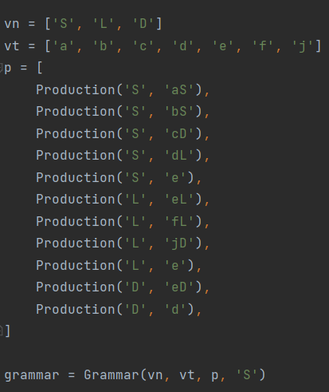
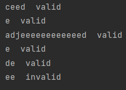
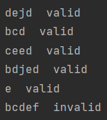

# Laboratory work nr.1
# Intro to formal languages. Regular grammars. Finite Automata.

### Course: Formal Languages & Finite Automata
### Author: Alexandru Buzu, FAF 212 (variant 4)

---


## Objectives:

1. Understand what a language is and what it needs to have in order to be considered a formal one.

2. Provide the initial setup for the evolving project that will be worked on during this semester.

    a. Create a local && remote repository of a VCS hosting service;

    b. Choose a programming language;

    c. Create a separate folder where the reports will be kept;

3. According to the variant number, get the grammar definition and do the following tasks:

    a. Implement a type/class for your grammar;

    b. Add one function that would generate 5 valid strings from the language expressed by the given grammar;

    c. Implement some functionality that would convert and object of type Grammar to one of type Finite Automaton;
    
    d. For the Finite Automaton, add a method that checks if an input string can be obtained via the state transition from it;


## Implementation description
I chose to complete the laboratory work in Python as it has intuitive syntax and is overall easier to code in.

To complete the given objectives I have implemented 4 classes for the grammar, production, finite automata and transition, inspired by the examples given during class. 

* The Grammar class has attributes for terminal and non-terminal variables, productions and starting value.

```python
class Grammar:
    def __init__(self, nterm, term, prod, strt):
        self.nonTerminalVar = nterm
        self.terminalVar = term
        self.productions = prod
        self.start = strt
```
* The Production class has attributes for the left and right side respectively.
The productions attribute in the above Grammar class is a list of Production objects.

```python
class Production:
    def __init__(self, left, right):
        self.leftSide = left
        self.rightSide = right
```
* The FiniteAutomaton has attributes for possible states, alphabet, transitions and initial and final states.

```python
class FiniteAutomaton:
    def __init__(self, possible, alphabet, transitions, strt, fin):
        self.possibleStates = possible
        self.alphabet = alphabet
        self.transitions = transitions
        self.initialState = strt
        self.finalStates = fin
```
* And the Transition class has attributes for current and next state, as well as the transition label.
The transitions attribute in the above FiniteAutomaton class is a list of Transition objects.

```python
class Transition:
    def __init__(self, current, nxt, label):
        self.currentState = current
        self.nextState = nxt
        self.transitionLabel = label
```
* For the function that generates a random valid word for the given grammar, it first
converts the list of productions to a dictionary, where the key is the left side of the production
and the value is a list containing the right sides of the production. This ensures that there are
no duplicate left side values for when it searches through them.

* After that, beginning with the starting value, when the function
finds a left side of production in the current string, it replaces it with a right side
randomly selected from the list corresponding to the left side it found, until
there are no more non-terminal values in the string, after which it returns the word.

```python
def generateWord(self):
  productionDict = {}
  for i in self.productions:
      if i.leftSide not in productionDict.keys():
          productionDict[i.leftSide] = []
          productionDict[i.leftSide].append(i.rightSide)
      else:
          productionDict[i.leftSide].append(i.rightSide)

  word = self.start
  while not word.islower():
      for i in productionDict.keys():
          if word.find(i) > -1:
              word = word.replace(i, choice(productionDict[i]), 1)

  return word
```

* The function that converts a grammar to a FiniteAutomaton object simply
maps the grammar object's attributes to new variables that are then used to return a FA
object. The non-terminal variables become possible states, the terminal variables
becomes the alphabet, the starting variable becomes the initial state.
* For the transitions, the function iterates through each production object, and the left side becomes
the current state, and from the left side the terminal variable becomes the transition, then for the next state, if the right 
side has 2 variables in it, the non-terminal variable becomes it, otherwise
it generates a new next state and also appends it to the final states list.
```python
    def toFiniteAutomaton(self):
        finalStates = []
        transitions = []
        c = 0
        for i in self.productions:
            if len(i.rightSide) == 2:
                transitions.append(Transition(i.leftSide, i.rightSide[1], i.rightSide[0]))
            else:
                c += 1
                transitions.append(Transition(i.leftSide, 'q' + str(c), i.rightSide))
                finalStates.append('q' + str(c))

        return FiniteAutomaton(self.nonTerminalVar, self.terminalVar, transitions, self.start, finalStates)
```
 
* Lastly, for the function that verifies if a string can be obtained using the state transition
of the finite automata, it starts with the initial state attribute and iterates through
each letter of the string, and if a letter is not included in the alphabet, the function returns false.
Then, for each letter, the function iterates through all transitions, and if currentState
is the same as the temporary state and transitionLabel is the same as the current letter
then it verifies few more conditions:
  * If it has not reached the end of the string, then the temporary state gets the value
  of nextState.
  * If it has reached the end of the string but nextState is not a final state, then it
  continues to iterate through the transitions.
  * And if it has reached the end of the string and nextState is a final state, then the temporary state gets the value
  of nextState.
* After each letter, it checks if the temporary state is a final state and if it has not reached 
the end of the word, if that is the case, then it returns false.
* Finally, after it iterates through all the letters, if the temporary state is a 
final state, it returns true.
```python
    def wordIsValid(self, word):
        state = self.initialState

        for i in range(len(word)):
            if word[i] not in self.alphabet:
                return False

            for j in self.transitions:
                if j.currentState == state and j.transitionLabel == word[i]:
                    if i != len(word) - 1:
                        state = j.nextState
                        break
                    elif i == len(word) - 1 and j.nextState not in self.finalStates:
                        continue
                    elif i == len(word) - 1 and j.nextState in self.finalStates:
                        state = j.nextState
                        break

            if state in self.finalStates and i != len(word) - 1:
                return False

        if state in self.finalStates:
            return True
        else:
            return False
```
* Instantiating a Grammar object with the variant 4 details.

## Conclusions
During this laboratory work I have learned a great deal about regular grammars
and finite automata, but mostly finite automata, as regular grammars are
a much simpler concept in my opinion. I have acquired knowledge of notions
such as states, transitions, transition labels and others, and successfully
used the knowledge to implement FA as well as a grammar into a computer
program. Admittedly, the program works only for a right-linear grammar, however,
it does its job properly and can be used to generate words, convert a grammar
to a FA, and validate words based on state transitions.
## Screenshots
Five generated words by the Grammar class and a user generated one,
all checked for validity by the FA.



---


## References
* Course lecture "Regular language. Finite automata"
* https://github.com/DrVasile/FLFA-Labs-Examples
* https://www.geeksforgeeks.org/python-classes-and-objects/
