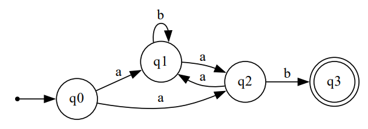
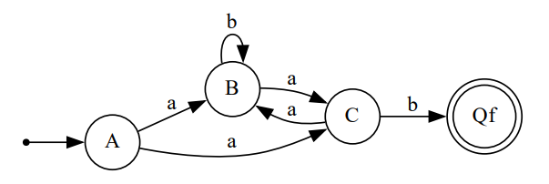
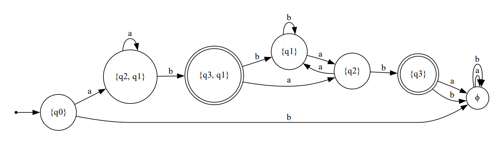

# Laboratory work nr.2
# Determinism in Finite Automata. Conversion from NDFA 2 DFA. Chomsky Hierarchy.
### University: Technical University of Moldova
### Course: Formal Languages & Finite Automata
### Author: Alexandru Buzu, FAF 212 (variant 4)

---

## Objectives:

1. Understand what an automaton is and what it can be used for.

2. Continuing the work in the same repository and the same project, the following need to be added:
    a. Provide a function in the grammar type/class that could classify the grammar based on Chomsky hierarchy.

3. According to the variant number (by universal convention it is register ID), get the finite automaton definition and do the following tasks:

    a. Implement conversion of a finite automaton to a regular grammar.

    b. Determine whether the FA is deterministic or non-deterministic.

    c. Implement some functionality that would convert an NDFA to a DFA.
    
    d. Represent the finite automaton graphically (Optional, and can be considered as a __*bonus point*__):
     

## Implementation description
* For the function that classifies the grammar based on Chomsky's 
hierarchy, I basically split it in two halves, one to differentiate between
type 0 and 1, and the second one between type 2 and 3.
  - If at least one production has two or more terminals and/or 
  non-terminals on the left side and no empty string on the right side,
  then it's Type 1.
  - If at least one production has two or more terminals and/or 
  non-terminals on the left side and empty string is on the right side,
  then it's Type 0.

```python
for i in self.productions:
    if len(i.leftSide) > 1:
        aux1 = True
    if i.rightSide.find('ε') > -1 :
        aux2 = True

if aux1 and aux2:
    return 'Type 0'
elif aux1 and not aux2:
    return 'Type 1'
```
* If the grammar is not of type 0 or 1, then we proceed to find which t
type it is between 2 and 3.
The rules for a grammar to be of type 3 are:
  * on the right side of production it can only have at most 1 non-terminal
  symbol and any number of terminal symbols
  * however, the non-terminal symbol has to be either at the start or end
  of the right side of production, and it has to be consistently
  on the same side
* If the previous 2 rules are not satisfied, then the grammar is of type 2,
and the rules are implemented below.

```python
c = 0
        for i in self.productions:
            c += 1
            if i.rightSide[0].isupper() and len(i.rightSide) > 1:
                linearity1 = 'L'
                break
            elif i.rightSide[-1].isupper() and len(i.rightSide) > 1:
                linearity1 = 'R'
                break
            elif c == len(self.productions):
                linearity1 = ''

        for i in self.productions:
            temp = sum(1 for c in i.rightSide if c.isupper())
            if temp > 1:
                return 'Type 2'
            elif temp == 1 and i.rightSide[0].islower() and i.rightSide[-1].islower():
                return 'Type 2'

            if i.rightSide[0].isupper() and len(i.rightSide) > 1:
                linearity2 = 'L'
            elif i.rightSide[-1].isupper() and len(i.rightSide) > 1:
                linearity2 = 'R'
            else:
                linearity2 = linearity1

            if linearity1 != linearity2:
                return 'Type 2'

        return 'Type 3'
```
* The function to convert a FA to a grammar is a simple mapping just
like in the function to convert a grammar to a FA. The defining feature 
is that final states are removed, and to ensure that the state names
are compatible with the functions in the grammar class, all state names
are converted to capital letters, ex. 'q0' becomes 'A'.
```python
    def toGrammar(self):
        nonTerminal = self.possibleStates
        for i in self.finalStates:
            nonTerminal.remove(i)
        terminal = self.alphabet
        from grammar.Grammar import Grammar
        from grammar.Production import Production
        production = []
        for i in self.transitions:
            if i.nextState in self.finalStates:
                production.append(Production(chr(nonTerminal.index(i.currentState) + 65), i.transitionLabel))
            else:
                production.append(Production(chr(nonTerminal.index(i.currentState) + 65), i.transitionLabel + chr(nonTerminal.index(i.nextState) + 65)))

        start = chr(nonTerminal.index(self.initialState) + 65)

        for i in range(len(nonTerminal)):
            nonTerminal[i] = chr(i + 65)

        return Grammar(nonTerminal, terminal, production, start)
```
* To classify a finite automaton, if it has multiple transitions for a 
given input symbol from a given state or if it has an epsilon transition,
then it is an NFA, otherwise it is a DFA.
```python
    def classify(self):
        for i in self.transitions:
            if i.transitionLabel == 'ε':
                return 'NFA'
            count = 0
            for j in self.transitions:
                if i.currentState == j.currentState and i.transitionLabel == j.transitionLabel:
                    count += 1
                if count > 1:
                    return 'NFA'
        return 'DFA'
```
* To convert from an NFA to a DFA, I use the method taught to us during
the course. To accomplish that the function first converts the
transitions into a dictionary of dictionaries, and as example you 
can see the 'test' dictionary below to visualize what I had in mind.
```python
    def toDFA(self):
        if self.classify() == 'DFA':
            return self
        
        test = {('q0',): {'a': {'q1', 'q2'}, 'b': {}}}
        
        nfa_dict = {}
        for i in self.possibleStates:
            nfa_dict.update({(i,): {}})
            for j in self.alphabet:
                nfa_dict[(i,)].update({j: set()})

        for i in self.transitions:
            nfa_dict[(i.currentState,)][i.transitionLabel].add(i.nextState)
```
* After that, it continues according to the algorithm. If it finds
a new state, such as '{q1, q2}', then it converts the set to a tuple
so it can become a key, adds it to the dictionary as a new state,
then for each transition label, creates the next state for the transition.
For example if we had: (q1, a) = {q1, q2}, (q1, b) = q1, (q2, a) = q2, 
(q2, b) = q1, then we would obtain: ({q1, q2}, a) = {q1, q2} and
({q1, q2}, b) = q1. 
```python
        def hasUndefinedStates():
            for x in nfa_dict.values():
                for y in x.keys():
                    z = x[y]
                    if len(z) > 0 and tuple(z) not in nfa_dict.keys():
                        return True
            return False

        
        deadState = False
        while hasUndefinedStates():
            temp_dict = {}
            for transition in nfa_dict.values():
                for tLabel in transition.keys():
                    newState = transition[tLabel]
                    if len(newState) == 0:
                        deadState = True

                    if len(newState) > 0 and tuple(newState) not in nfa_dict.keys():
                        temp_dict[tuple(newState)] = {}
                        for j in self.alphabet:
                            temp_dict[tuple(newState)].update({j: set()})

                        for i in newState:
                            for j in self.alphabet:
                                temp_dict[tuple(newState)][j].update(nfa_dict[(i,)][j])

            nfa_dict.update(temp_dict)
```
* After that is done, it is only a matter of mapping the data in
the dictionary into a new FA object. The tuple keys of the dict are 
converted into sets and then into a string and then added to the
possible states list and final states list if appropriate. The 
components of the transitions are also modified where necessary by 
converting them to strings.
Any empty set is converted to the dead state 'ϕ'.
All this is done so the states can be read by the class functions
and also look nice in the graphical representation.
```python
        states = []
        fStates = []
        for i in nfa_dict.keys():
            aux = str(set(i)).replace("'", '')
            states.append(aux)
            for j in i:
                if j in self.finalStates:
                    fStates.append(aux)
                    break

        if deadState:
            states.append('ϕ')
            nfa_dict['ϕ'] = {}
            for i in self.alphabet:
                nfa_dict['ϕ'].update({i: 'ϕ'})
                
        for transition in nfa_dict.values():
            for tLabel in transition.keys():
                newState = transition[tLabel]
                if len(newState) == 0:
                    transition[tLabel] = 'ϕ'

        from automata.Transition import Transition
        from automata.FiniteAutomaton import FiniteAutomaton
        transitions = []
        for transition in nfa_dict.keys():
            for tLabel in nfa_dict[transition].keys():
                if transition == 'ϕ':
                    transitions.append(Transition(transition,
                                                  tLabel,
                                                  str(nfa_dict[transition][tLabel]).replace("'", '')))
                else:
                    transitions.append(Transition(str(set(transition)).replace("'", ''),
                                                  tLabel,
                                                  str(nfa_dict[transition][tLabel]).replace("'", '')))

        return FiniteAutomaton(states, self.alphabet, transitions, str({self.initialState}).replace("'", ''), fStates)
```
* To represent the FA graphically I used the graphviz library. States 
are turned to nodes and transitions to edges. Final states are represented
by a double circle, others by just a simple circle, and the graph
itself is a directed one, so we have arrows between the nodes. The 
function creates a .pdf file with the graph representation of the FA.
```python
    def display(self):
        f = Digraph()
        f.attr(rankdir="LR")

        f.node("Initial", label="", shape="point")
        f.attr('node', shape='doublecircle')
        for i in self.finalStates:
            f.node(i)

        f.attr('node', shape='circle')
        for i in self.possibleStates:
            if i not in self.finalStates:
                f.node(i)

        f.edge("Initial", self.initialState)
        for i in self.transitions:
            f.edge(i.currentState, i.nextState, label=i.transitionLabel)

        f.view(tempfile.mktemp('.gv'))
```
## Screenshots/ Results
* For Chomsky classification:
```python
vn = ['S', 'L', 'D']
vt = ['a', 'b', 'c', 'd', 'e', 'f', 'j']
p = [
    Production('S', 'aS'),
    Production('S', 'bS'),
    Production('S', 'cD'),
    Production('S', 'dL'),
    Production('S', 'e'),
    Production('L', 'eL'),
    Production('L', 'fL'),
    Production('L', 'jD'),
    Production('L', 'e'),
    Production('D', 'eD'),
    Production('D', 'd'),
]

grammar = Grammar(vn, vt, p, 'S')
print(grammar.classify())
```
Output:
```
Type 3
```
```python
vn = ['S', 'L', 'D']
vt = ['a', 'b', 'c', 'd', 'e', 'f', 'j']
p = [
    Production('S', 'aa'),
    Production('S', 'Dc'),
    Production('S', 'c'),
    Production('S', 'L'),
    Production('S', 'e'),
    Production('L', 'eL'),
    Production('D', 'De'),
    Production('D', 'd'),
]

grammar2 = Grammar(vn, vt, p, 'S')
print(grammar2.classify())
```
Output:
```
Type 2
```
* For conversion of FA to grammar I convert the given FA to grammar
then back to FA and then display it, to show that it retains its 
proprieties.
```python
q = ['q0', 'q1', 'q2', 'q3']
a = ['a', 'b']
t = [
    Transition('q0', 'a', 'q1'),
    Transition('q0', 'a', 'q2'),
    Transition('q1', 'b', 'q1'),
    Transition('q1', 'a', 'q2'),
    Transition('q2', 'a', 'q1'),
    Transition('q2', 'b', 'q3'),
]
s = 'q0'
f = ['q3']

automata = FiniteAutomaton(q, a, t, s, f)
print('The given automata is a ' + automata.classify())
automata.display()
automata.toGrammar().toFiniteAutomaton().display()
```
Output:


* The above code also has the part for the FA classification, and the 
output is:
```
The given automata is a NFA
```
* And finally, for the conversion of NFA to DFA.
```python
automata.toDFA().display()
```
Output:

## Conclusions
During the laboratory work I have recapped a lot of material regarding
FAs and have implemented in code functions to classify them and convert
from NFA and DFA. The latter function was the toughest one to implement,
as I used python dictionaries extensively and I had to do a lot of
research on the methods that can be used on them. After creating that
function, I became thankful that I used a class for transitions and 
not dictionaries, as working with transitions objects is easier and
much more intuitive. Beside that, the function to find the typing of
a grammar was also quite finicky to implement as it required a ton of
conditions and exceptions, especially for type 3.
## References
* Course lecture "Regular language. Finite automata"
* https://en.wikipedia.org/wiki/Chomsky_hierarchy
* https://graphviz.readthedocs.io/en/stable/manual.html
